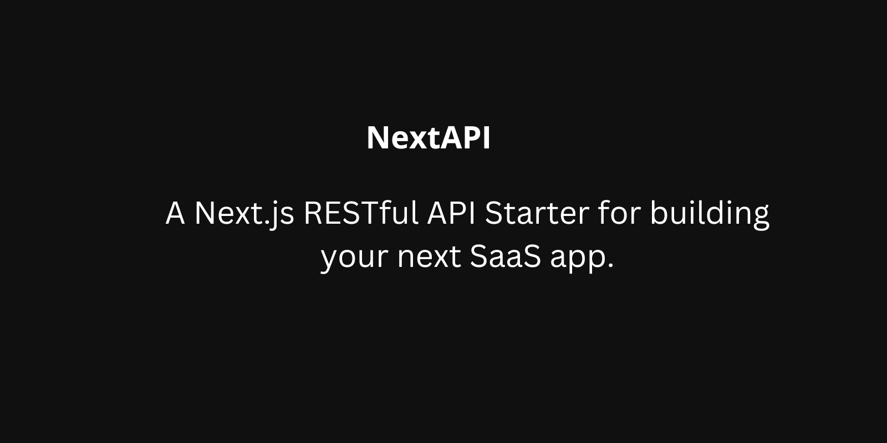

  <h1><strong>NextAPI</strong></h1>

  A Next.js RESTful API Starter for building your next SaaS app.

## Introduction

Let NextAPI handle the heavy lifting for common SaaS features such as authentication, team management, invites, subscriptions, and more.

Say goodbye to tedious backend boilerplate code and focus on what matters most - building user-friendly UI/UX that delight your customers.

With its powerful combination of Next.js, Supabase, and Prisma - NextAPI provides the perfect foundation for creating scalable and feature-rich SaaS apps.

## Built with

- [Next.js](https://nextjs.org/)
- [Supabase](https://supabase.io/)
- [Prisma](https://www.prisma.io/)
- [TypeScript](https://www.typescriptlang.org/)
- [React.email](https://react.email/)

## API routes

NextAPI comes with a set of API routes that you can use within your React components.

| Method | Path                               | Description              |
| ------ | ---------------------------------- | ------------------------ |
| POST   | /api/auth/signup                   | Sign up a new user       |
| POST   | /api/auth/signin                   | Sign in an existing user |
| POST   | /api/teams                         | Create a new team        |
| GET    | /api/teams                         | Get all teams for user   |
| GET    | /api/teams/:slug                   | Get a team               |
| DELETE | /api/teams/:slug                   | Delete a team            |
| PUT    | /api/teams/:slug                   | Update a team            |
| POST   | /api/teams/:slug/invites           | Create a new invite      |
| GET    | /api/teams/:slug/invites           | Get all invites for team |
| GET    | /api/teams/:slug/invites/:inviteId | Get an invite            |
| DELETE | /api/teams/:slug/invites/:inviteId | Delete an invite         |
| GET    | /api/teams/:slug/members           | Get all members for team |
| PUT    | /api/teams/:slug/members/:memberId | Update a member          |
| DELETE | /api/teams/:slug/members/:memberId | Delete a member          |
| GET    | /api/me                            | Get current user         |
| PUT    | /api/me                            | Update current user      |

[API Documentation](https://documenter.getpostman.com/view/13376907/2s8ZDYWgZ1)

## Emails are sent for the following events

- When a new user signs up
- When a new invite is created
- When a user is added to a team
- When a user is removed from a team

## Getting started

- Fork this repository
- Clone your forked repository
- Navigate to the project directory
- Run `npm install` to install dependencies
- Copy `.env.example` to `.env.local` and update the environment variables
- Run `npm run dev` to start the development server

## License

MIT License
